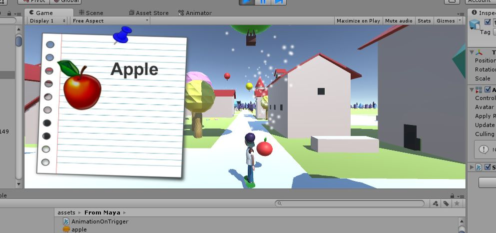

# "Magic Box Worlds" game

This is the script written for a prototype of a language learning game for kids called "Magic Box Worlds".

Every time the user encounters objects that are meant for learning the user can see on the screen the picture, the written word and hears the pronounciation of the encountered object.

You can check the prototype [HERE](http://annaporo.site/langgame/langgame.html)
